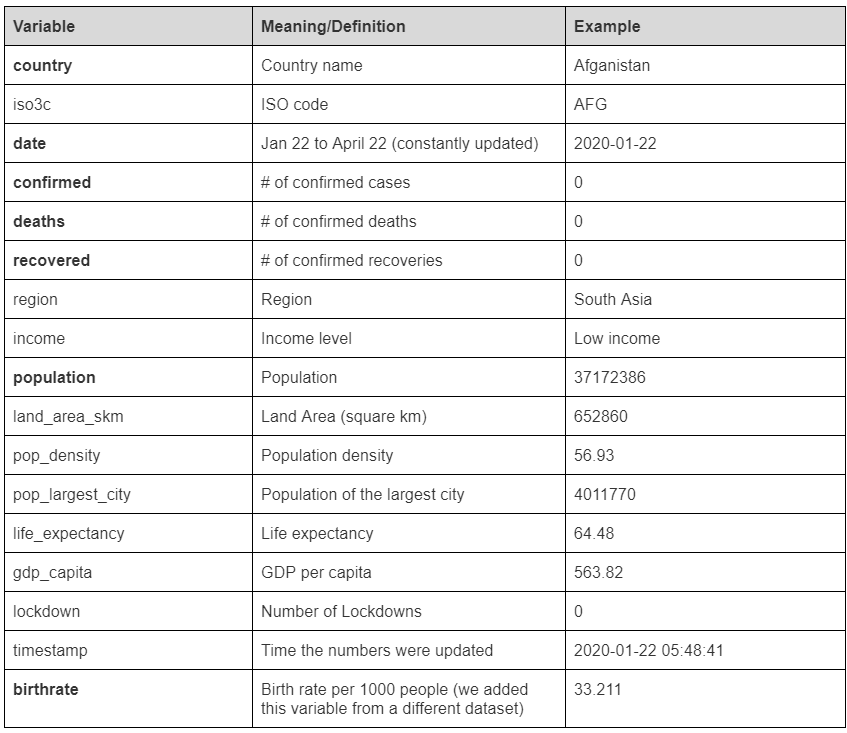
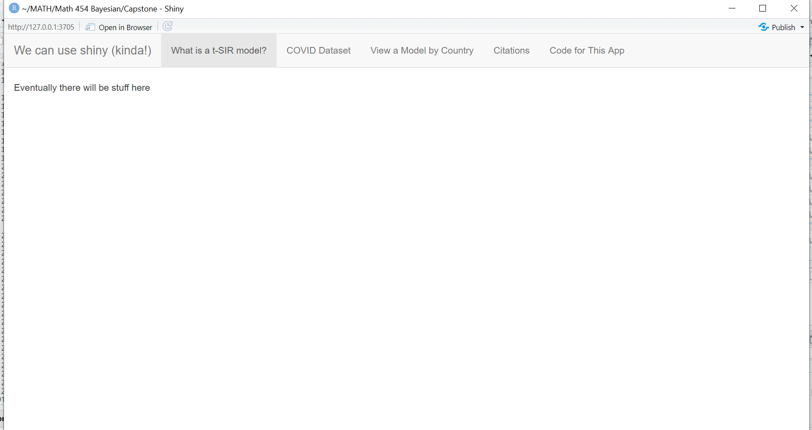

# Part 1: Progress

Our final work is most likely to be a shiny app that explains the model and data source as well as running SIR-model simulations for the COVID data by country. For this check-in, however, we have all the writings in the homework-like layout and shiny app running at the end. 


## Introduction

For the last few months, the spread of COVID-19 virus has caused enormous impacts on people's lives around the world. Researchers are using various statistical methods to predict the number of patients and how rapidly the virus will spread to help the government and organizations to take protective measures. 

Our project aims to fit the commonly used time-series SIR model based on Bayesian method on the number of confirmed cases in different countries. We used the open-source data from Johns Hopkins Coronavirus Resource Center and other public data sources. We used R packages called *tidycovid19* to create the dataset and *tSIR* to run SIR model on this data. 

## Setup

```{r message=FALSE, warning=FALSE}
library(devtools)
library(ggplot2)
library(tidyr)
library(readr)
library(purrr)
library(dplyr)
library(stringr)
library(forcats)
library(rclipboard)
library(shiny)
```

\
\

## Data

The dataset is created by a German Economist Joachim Gassen as a Github Package "tidycovid19" to facilitate the direct download of various Covid-19 related data from authoritative sources. The main source is the widely used Johns Hopkins University CSSE Github Repo. It also provides a flexible function and accompanying shiny app to visualize the spreading of the virus. 

Blog Link: https://www.r-bloggers.com/meet-tidycovid19-yet-another-covid-19-related-r-package/ 
Github Link: https://github.com/joachim-gassen/tidycovid19
 
```{r message=FALSE, warning=FALSE}
install_github("joachim-gassen/tidycovid19")
library(tidycovid19)
covid19_dta <- download_merged_data(silent = TRUE, cached = TRUE)
```

```{r}
df <- covid19_dta %>%
  select(country, iso3c, date, confirmed, deaths, recovered, region, income, population, land_area_skm, pop_density, pop_largest_city, life_expectancy, gdp_capita, lockdown, timestamp)
```

```{r}
dim(df)
names(df)
head(df, 3)
#summary(df)
```

There are 182 countries and each country has the same number of days. (Jan 22nd to the previous day) 
The following table is the list of variables and their definitions in the dataset. 



\
\

## Visualizations

We use the function plot_covid19_spread to visualize the four values of interest; confirmed cases. The function uses ggplot to create visualizations that are easy to understand and customizeable.

Documentation: https://rdrr.io/github/joachim-gassen/tidycovid19/man/plot_covid19_spread.html

```{r}
plot_covid19_spread(
  type = "confirmed",
  df, 
  intervention = "lockdown",
  highlight = c("ITA", "ESP", "FRA", "DEU", "USA","CHN","BRA","GBR", "BEL"),
  edate_cutoff = 50,
  per_capita = TRUE, 
  per_capita_x_axis = TRUE,
  population_cutoff = 10,
  min_cases = 0.1
)
```

The plot shows how the number of reported confirmed cases (in log-scale) grew in the first 50 days after the breakout, which is defined as when confirmed cases per 100,000 inhabitants exceeded 0.1. This approach allows counties to be compared vertically. Each line represents a country and the major countries of our concern are colored. We can see that the European countries and US have the highest growth rate. China’s number of confirmed cases stopped increasing after around Day 20. We need to keep in mind that the data from some countries such as Brazil (and perhaps most countries) might not be accurate as the governments have failed to implement wide range testing. 


\
\

In order to use the SIR model, we are adding the country’s birthrate to this dataset. The source of birthrate is WHO.


## Model 

For modeling, we are going to use the model called SIR model. It is a widely known model for measuring the spread of infectious disease. tsiR is an R package that is used for implementation of the SIR model using a number of different fitting options for time-series data. 

Our tsiR (Poisson) models take the data for the number of cases, and simulate the trajectory of the disease over time. It is a Bayesian model with a vague Gaussian prior with mean 1E-4. 

R documentation: https://www.rdocumentation.org/packages/tsiR/versions/0.3.0

```{r, warning=FALSE, message=FALSE}
## load the package and dependencies
## kernlab is for the gaussian process 
## the rest are for plotting 
require(tsiR)
require(kernlab)
require(reshape2)
require(grid)
```


## Fit the model

Since we can only fit the model for one country(subject) at a time, we choose Italy for this part. Our goal is to make the shiny app that lets the users to choose the country of interet and run the simulation on that country.

```{r}
load("covid.Rda")
covid <- data

covid$pop <- covid$population
covid$time <- covid$date
covid$cases <- covid$confirmed
covid$births <- covid$BirthRate * 60421.760      ## change this to the population/1000 for each country
df_country <- covid %>% filter(country == "Italy") %>% select(pop, time, births, cases)
```


One limitation in our model is that it is made for weekly data. Although our COVID data is a daily data since January to April, we need to aggregate the numbers to week. This reduces the number of observations for each country to 12 weeks. We will explore if there are ways to fit the model on daily data but for the sake of the project, we are going to use weekly number. 

Since we need to aggregate the number of cases to weekly, the number for the most recent week won't be complete. Thus, we take out the 17th week from the data before fitting the model here.

IP stands for Infection Period and it is set at 1 week here. The plot shows country's population, and number of births, and the number of confirmed cases. The first two numbers are constant since we are only focusing on the three months after the spread of the virus started.

 
```{r message=FALSE}
require(xts)
library(lubridate)
df_weekly <- df_country%>%
  group_by(time = week(time)) %>% 
  summarise(births = mean(births),
            pop = mean(pop),
            cases = sum(cases)) %>%
  filter(time!=17)

tsiRdata(df_weekly$time, df_weekly$cases, df_weekly$births, df_weekly$pop, IP=1)

plotdata(df_weekly)
```

Here, we create a simulation for the number of confirmed cases in Italy. The blue line shows the actual number of cases reported (it is inversed in the second plot for unknown reason). The brown lines in the first plot show randomly chosen 10 simulations overlayed, and in the bottom plot it shows the means of these simulations with confidence intervals.


```{r warning=FALSE} 
df_countryParms <- estpars(data=df_weekly,IP=1,
                          alpha=0.97, sbar=NULL,
                          regtype='loess',
                          family='gaussian',link='identity')  ## This was changed to gaussian to make this model Bayesian

#plotbreaks(data=df_weekly,threshold=3)

df_countryRes <- simulatetsir(data=df_weekly,IP=1,
                             parms=df_countryParms,
                             epidemics='break',threshold=4,
                             method='pois',nsim=100)


## the last two plots are forward simulations 
## the top forward simulation is 10 randomly chosen simulations
## the bottom is the mean (with CI)
plotcomp(df_countryRes)

```

Although we are still working on the interpretation of the posteior of these simulations, we do observe similar result for differnt countries that are experiencing similar growth pattern of the number. We still don't know why the predictions are much higher than actual numbers and how it crated the spike at the 14th week. 


\
\

## Shiny App

Here, we show how we will use Shiny app to demonstrate our final works. The codes run the app with a few separate tabs, which will eventually describe our projects and let the users run the simulations on the country of choice. We put the screenshot of the app below.

```{r}
require(reshape2)

# Define UI for app that has tabs at the top ----
ui <- navbarPage("We can use shiny (kinda!)",
  tabPanel("What is a t-SIR model?",
           "Eventually there will be stuff here"),
  tabPanel("COVID Dataset",
           "and here"
           # install_github("joachim-gassen/tidycovid19"),
           # library(tidycovid19),
           # covid19_dta <- download_merged_data(silent = TRUE, cached = TRUE),
           # df <- covid19_dta %>%
           # select(country, iso3c, date, confirmed, deaths, recovered, region, income, population, land_area_skm, pop_density, .data, pop_largest_city, life_expectancy, gdp_capita, lockdown, timestamp),
           # dim(df),
           # names(df),
           # head(df),
           # summary(df)
  ),
  tabPanel("View a Model by Country",
           "and here"),
  tabPanel("Citations",
           "here's one sad citation all by itself right now and I can't figure out how to put text on different lines lol",
           "Wickham Hadley. ggplot2: Elegant Graphics for Data Analysis; 2009.
Wickham H. Reshaping Data with the reshape Package; 2007. Available from: https://cran.r-project.org/web/packages/reshape2/
"),
  tabPanel("Code for This App",
           "blahhblahh")

)


# Define server logic to summarize and view selected dataset ----
server <- function(input, output) {

  # Return the requested dataset ----
  datasetInput <- reactive({
    switch(input$dataset,
           "rock" = rock,
           "pressure" = pressure,
           "cars" = cars)
  })

  # Generate a summary of the dataset ----
  output$summary <- renderPrint({
    dataset <- datasetInput()
    summary(dataset)
  })

  # Show the first "n" observations ----
  output$view <- renderTable({
    head(datasetInput(), n = input$obs)
  })

}
```

```{r echo=FALSE}
# Create Shiny app ----
#shinyApp(ui = ui, server = server)
```



\
\


# Part 2: Contributions 

As a team, we collaborated to run the simulation on the COVID data on Zoom. Additionally, Daijiro wrote up this rmd. Christina cleaned and merged the dataset. Ciara ran the simulations on Rstudio while the zoom session and worked on Shiny app. 

Since the last check-in, we input actual COVID data into the tsiR models and started on the shiny representation of our models for the final work.
l.


