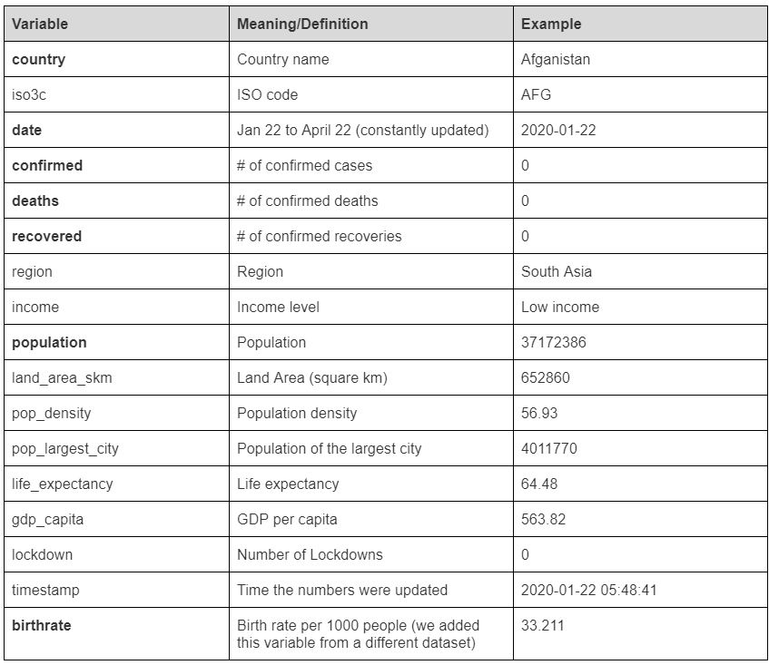

## Setup

```{r warning=FALSE, message=FALSE}
library(devtools)
library(ggplot2)
library(tidyr)
library(readr)
library(purrr)
library(dplyr)
library(stringr)
library(forcats)
library(rclipboard)
library(shiny)
```

\
\

## 1. Data

The dataset is created by a German Economist Joachim Gassen as a Github Package "tidycovid19" to facilitate the direct download of various Covid-19 related data from authoritative sources. The main source is the widely used Johns Hopkins University CSSE Github Repo. It also provides a flexible function and accompanying shiny app to visualize the spreading of the virus. 

Blog Link: https://www.r-bloggers.com/meet-tidycovid19-yet-another-covid-19-related-r-package/ 
Github Link: https://github.com/joachim-gassen/tidycovid19

In order to use the SIR model, we are adding the country’s birthrate to this dataset. The source of birthrate is WHO. 

```{r message=FALSE}
install_github("joachim-gassen/tidycovid19")

library(tidycovid19)
covid19_dta <- download_merged_data(silent = TRUE, cached = TRUE)
```

```{r}
df <- covid19_dta %>%
  select(country, iso3c, date, confirmed, deaths, recovered, region, income, population, land_area_skm, pop_density, pop_largest_city, life_expectancy, gdp_capita, lockdown, timestamp)
```

\
\

## 2. Data summary

```{r}
dim(df)
names(df)
head(df)
summary(df)
```

There are 182 countries and each country has the same number of days. (Jan 22nd to the previous day) 
The following table is the list of variables and their definitions in the dataset. 



\
\

## 3. Visualizations

We use the function plot_covid19_spread to visualize the four values of interest; confirmed cases, deaths, recoveries, and active cases (confirmed - recovered). The function uses ggplot to create visualizations that are easy to understand and it is customizeable.

Documentation: https://rdrr.io/github/joachim-gassen/tidycovid19/man/plot_covid19_spread.html

```{r}
plot_covid19_spread(
  type = "confirmed",
  df, 
  intervention = "lockdown",
  highlight = c("ITA", "ESP", "FRA", "DEU", "USA","CHN","BRA","GBR", "BEL"),
  edate_cutoff = 50,
  per_capita = TRUE, 
  per_capita_x_axis = TRUE,
  population_cutoff = 10,
  min_cases = 0.1
)
```

The first plot shows how the number of reported confirmed cases (in log-scale) grew in the first 50 days after the breakout, which is defined as when confirmed cases per 100,000 inhabitants exceeded 0.1. This approach allows counties to be compared vertically. Each line represents a country and the major countries of our concern are colored. We can see that the European countries and US have the highest growth rate. China’s number of confirmed cases stopped increasing after around Day 20. We need to keep in mind that the data from some countries such as Brazil (and perhaps most countries) might not be accurate as the governments have failed to implement wide range testing. 


```{r}
plot_covid19_spread(
  type = "deaths",
  df, 
  intervention = "lockdown",
  highlight = c("ITA", "ESP", "FRA", "DEU", "USA","CHN","BRA","GBR", "BEL"),
  edate_cutoff = 50,
  per_capita = TRUE, 
  per_capita_x_axis = TRUE,
  population_cutoff = 10,
  min_cases = 0.1
)
```

This plot shows how the number of reported death cases (in log-scale) grew in the first 50 days after the breakout defined by the death cases. Similarly to the first plot, countries such as Spain, Italy, Belgium, UK, France and US observed a high rate of growth compared to others. China had fewer reported death/population than these countries since the beginning of the breakout. 


```{r}
plot_covid19_spread(
  type = "recovered",
  df, 
  intervention = "lockdown",
  highlight = c("ITA", "ESP", "FRA", "DEU", "USA","CHN","BRA","GBR", "BEL"),
  edate_cutoff = 50,
  per_capita = TRUE, 
  per_capita_x_axis = TRUE,
  population_cutoff = 10,
  min_cases = 0.1
)
```

The above plot is for the reported recovery cases. First of all, we see that some countries reported many cases so the intercept seems to be more variable than the previous two plots. United Kindom's rate is among the lowest and China’s rate is lower than other European countries such as Germany and Spain. This number does not necessarily measure if countries are doing well or not. For example, Spain and Germany have similar curves but number of confirmed cases per population in Spain is much higher than Germany. The plot simply shows the number of recovery cases in every 100,000 inhabitants. Simiraly, countries with few confirmed cases would have less population to recovery and have low recovery rate. 


```{r}
plot_covid19_spread(
  type = "active",
  df, 
  intervention = "lockdown",
  highlight = c("ITA", "ESP", "FRA", "DEU", "USA","CHN","BRA","GBR", "BEL"),
  edate_cutoff = 50,
  per_capita = TRUE, 
  per_capita_x_axis = TRUE,
  population_cutoff = 10,
  min_cases = 0.1
)
```

The above plot is for the reported active cases. It is calculated by subtracting the number of recovery cases from confirmed cases. (It does not seem to include death cases. We'll look into this further as we want to fit the SIR model.) Some countries observe the declining rate earlier than other countries like China. 


Since plot_covid19_spread does not support other than these four numbers, we made a simple ggplot visualization of mortality rate (deaths devided by confirmed) for selected countries. The mortality rate is often mentioned as the severity of the coronavirus in these countries. The graph shows that the rate was very high (above 10%) in some countries such as Belgium and Italy. 

```{r}
df_mortality <- df %>% 
  mutate(mortality_rate = deaths/confirmed) %>%
  na.omit(mortality_rate) %>%
  filter(iso3c %in% c("ITA", "ESP", "FRA", "DEU", "USA","CHN","BRA","GBR", "BEL"))

ggplot(df_mortality, aes(x = date, y = mortality_rate)) + 
  geom_line(aes(color = country), size = 1) +
  theme_minimal()
```


Based on these visualizations, we found that, even after controlling for the population, there is a very high variablity in these rates across the countries. The number of testings in these countries vary significantly and make the country comparison challenging. Even when we used the mortality rate, we need to be noted that these rates are based on the number of cases, and each country has different criteria for testing. Since our objective is to fit the SIR model for these countries, we need to figure out how to deal with the country-level difference. 


\
\

```{r}
load(file = "covid.Rda")
```


## 4. Model 

For modeling, we are going to use the model called SIR model. It is a widely known model for measuring the spread of infectious disease. tsiR is an R package that is used for implementation of the SIR model using a number of different fitting options for time-series data. 

R documentation: https://www.rdocumentation.org/packages/tsiR/versions/0.3.0

```{r, warning=FALSE, message=FALSE}
## load the package and dependencies
## kernlab is for the gaussian process 
## the rest are for plotting 
require(tsiR)
require(kernlab)
require(reshape2)
require(grid)
```


```{r}
theme_set(theme_gray(base_size = 22))
## twentymeas is the included data set and is a list
## pull out cities by name 
names(twentymeas)
```


These tsiR (Poisson) models take the data for the number of cases, and simulate the trajectory of the disease over time. It is a Bayesian model with a vague Gaussian prior with mean 1E-4. The first model has 10 simulations overlayed, and the bottom model has the means and confidence intervals of these simulations.
 
 
```{r}
## Northwich example
NorthwichMeas <- twentymeas[["Northwich"]]

plotdata(NorthwichMeas)

NorthwichParms <- estpars(data=NorthwichMeas,IP=2,
                          alpha=0.97, sbar=NULL,
                          regtype='loess',
                          family='gaussian',link='identity')  ## This was changed to gaussian to make this model Bayesian

plotbreaks(data=NorthwichMeas,threshold=3)

NorthwichRes <- simulatetsir(data=NorthwichMeas,IP=2,
                             parms=NorthwichParms,
                             epidemics='break',threshold=3,
                             method='pois',nsim=100)


## the last two plots are forward simulations 
## the top forward simulation is 10 randomly chosen simulations
## the bottom is the mean (with CI)
plotcomp(NorthwichRes)
```


\
\

## 5. Next step

First, we want to input actual COVID data into the tsiR models. We are also planning on doing a shiny representation of our final models and how we got there.

## Contributions

Daijiro found the main dataset and cleaned and condensed it. Christina made the data visualizations, provided birth data, and merged the data. Ciara modified, troubleshooted, and interpreted the TSIR model.


```{r}
 library(timeSeries)
data_n <- as.xts(data$confirmed,order.by=as.Date(data$date))
weekly <- apply.weekly(data_n, sum)

```

